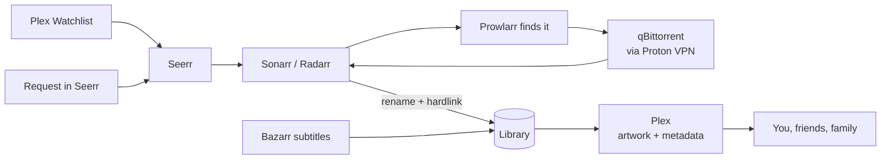

# ⚓ MediaHarbor

A self-hosted media server that fills itself. Add a movie to your Plex Watchlist, and it shows up in your library, sorted, with artwork and subtitles. Share it with friends and family, and let them ask for what they want to watch.

Everything runs in Docker Compose on one Linux box. Downloads go through **Proton VPN**. Admin screens stay private behind **Tailscale**. Only Plex faces the internet.

## How it works



1. You or a friend add a title to a Plex Watchlist, or request it in Seerr.
2. Seerr sends the request to Sonarr (TV) or Radarr (movies).
3. Prowlarr searches your indexers. qBittorrent downloads through the VPN.
4. Sonarr and Radarr rename the files and put them in the library. Bazarr adds subtitles.
5. Plex scans the new file, adds posters and details, and everyone can watch.

## What runs

Core apps always run. Each optional app has a Compose profile of the same name. `config/host.env.example` turns on every profile.

| App | Job | Local port | Profile |
| --- | --- | --- | --- |
| Plex | Watch and share your library | 32400 (public) | Core |
| Seerr | Requests and Plex Watchlist auto-requests | 5055 | Core |
| Sonarr / Radarr | TV / movie automation and file organization | 8989 / 7878 | Core |
| Prowlarr | Indexer manager | 9696 | Core |
| Bazarr | Subtitles | 6767 | Core |
| Gluetun + qBittorrent + port-sync | Proton WireGuard VPN, downloads, forwarded-port updates | 8080 | Core |
| Tautulli | Plex activity and stats | 8181 | `tautulli` |
| Recyclarr | Syncs recommended quality profiles to Sonarr/Radarr | — | `recyclarr` |
| Unpackerr | Extracts archived downloads before import | — | `unpackerr` |
| FlareSolverr | Helps Prowlarr reach Cloudflare-protected indexers | — | `flaresolverr` |
| Jellyfin | Open-source player, alternative to Plex | 8096 | `jellyfin` |
| Lidarr | Music automation | 8686 | `lidarr` |
| SABnzbd | Usenet downloads | 8081 | `sabnzbd` |
| Bookshelf | Audiobook automation (a Readarr revival) | 8787 | `bookshelf` |
| Audiobookshelf | Audiobook player with phone apps | 13378 | `audiobookshelf` |
| Homepage | Dashboard | 3000 | `homepage` |

## Security model

- Every admin port binds to `127.0.0.1`. You reach them over Tailscale or an SSH tunnel.
- Plex port 32400 is the only port open to the network. Plex signs in every client itself.
- qBittorrent shares the VPN container's network. If the VPN drops, its traffic stops.
- No Docker socket mounts, no default passwords, no automatic container updates.
- Every image is pinned to a digest. Renovate proposes updates for you to review.
- Credentials live in ignored files under `secrets/`, mounted as Compose secrets.
- `./harbor check` enforces these rules. CI runs it with a secret scan.

See [SECURITY.md](SECURITY.md) to report a problem.

## Requirements

- Linux on amd64 or arm64, with your media disk mounted by UUID. This project does not format disks or set up RAID, ZFS, SMB or NFS.
- Docker Engine **28+** and Compose **2.24+**.
- Python **3.10+**.
- A free Tailscale account.
- A paid Proton VPN plan with P2P port forwarding.
- A Plex account. Plex Pass is optional (it adds hardware transcoding).
- `restic` and `age` for backups.

## Set it up

Run every command on the server. Do the steps in order.

### 1. Get the files

```sh
sudo mkdir /opt/mediaharbor
sudo chown "$USER": /opt/mediaharbor
git clone https://github.com/david-rodriguez/MediaHarbor.git /opt/mediaharbor
cd /opt/mediaharbor
./harbor init
```

`init` creates `config/host.env` and the `secrets/` folder. Git ignores both.

### 2. Set up Tailscale

Tailscale gives your own devices private, secure links to the apps.

1. Install Tailscale and sign in. Open the link that `tailscale up` prints.

   ```sh
   curl -fsSL https://tailscale.com/install.sh | sh
   sudo tailscale up
   ```

2. In the Tailscale admin console, open [DNS](https://login.tailscale.com/admin/dns). Turn on **MagicDNS** and **HTTPS Certificates**.
3. Create the app links:

   ```sh
   sudo tailscale serve --bg --https=443 http://127.0.0.1:5055
   sudo tailscale serve --bg --https=8443 http://127.0.0.1:8080
   for port in 8989 7878 9696 6767 8181 8096 8686 8081 8787 13378 3000; do
     sudo tailscale serve --bg --https=$port http://127.0.0.1:$port
   done
   ```

4. Show the server's Tailscale name. You need it for your settings in the next step.

   ```sh
   tailscale status --json | python3 -c 'import json,sys; print(json.load(sys.stdin)["Self"]["DNSName"].rstrip("."))'
   ```

5. Install Tailscale on your phone and computer. Sign in with the same account.

Seerr opens at `https://YOUR-TAILSCALE-NAME`, and qBittorrent at `https://YOUR-TAILSCALE-NAME:8443`. Every other app opens at its port from the [What runs](#what-runs) table. If other people use your Tailscale network, [limit who can reach the server](docs/access.md#limit-who-can-reach-the-server).

### 3. Fill in your settings

Open the settings file:

```sh
nano config/host.env
```

Change these lines:

| Setting | What to put |
| --- | --- |
| `PUID` and `PGID` | The output of `id -u` and `id -g` |
| `TZ` | Your timezone, for example `America/New_York` |
| `APPDATA_ROOT` | A folder for app settings, for example `/srv/mediaharbor/appdata` |
| `DATA_ROOT` | A folder on your media disk |
| `PROTON_COUNTRIES` | A VPN country, for example `Netherlands` |
| `COMPOSE_PROFILES` | Delete the optional apps that you do not want |
| `HOMEPAGE_ALLOWED_HOSTS` and `HOMEPAGE_VAR_BASE_URL` | Replace `[YOUR-TAILSCALE-NAME]` with the name from step 2, for example `nas.tail1234.ts.net`. Keep `:3000` and `https://`. |

A value in square brackets, such as `[YOUR-TAILSCALE-NAME]`, is a placeholder. `./harbor check` stops until you replace each one.

Leave `HARBOR_ROOT` commented out, unless you use Portainer.

### 4. Add your VPN key and qBittorrent password

1. On the Proton VPN website, open **Downloads > WireGuard configuration**. Pick **Linux**, turn on **NAT-PMP (port forwarding)** and download the file.
2. Open that file. Copy the text after `PrivateKey = `.
3. Paste it into the key file, then save:

   ```sh
   nano secrets/wireguard_private_key
   ```

4. Make a qBittorrent password:

   ```sh
   openssl rand -base64 24 > secrets/qbit_password
   ```

The qBittorrent username is `admin`, from `secrets/qbit_username`.

### 5. Check and prepare

```sh
./harbor check
sudo ./harbor prepare
```

If `check` prints a problem, fix it and run `check` again. `prepare` creates the app and media folders.

> **Portainer users:** stop here and follow [Portainer stacks](docs/portainer.md).

### 6. Start the VPN and qBittorrent

```sh
./harbor compose up -d gluetun qbittorrent
```

Log in to qBittorrent and lock it down with [private access](docs/access.md#first-login-with-ssh). Set its account to the username and password in `secrets/`.

### 7. Start Plex

1. Get a claim token from <https://plex.tv/claim>. It works for 4 minutes only.
2. At once, run this with your token:

   ```sh
   echo 'claim-YOUR-TOKEN' > secrets/plex_claim
   ./harbor compose up -d plex
   ```

3. Open Plex through the [SSH tunnel](docs/access.md#first-login-with-ssh). Add the Plex libraries from the [library folders](docs/operations.md#library-folders) table.

### 8. Start everything else

```sh
./harbor compose up -d
```

Set a password in each app. Then connect the apps with the [app connections](docs/operations.md#app-connections) table.

### 9. Before you download anything real

1. Run the [deployment checks](docs/operations.md#deployment-checks).
2. Set up [encrypted backups](docs/recovery.md) and do one restore drill.
3. Optional: [share with friends and family](docs/sharing.md).

Always use `./harbor compose` instead of plain `docker compose`. The wrapper picks the right Compose file and settings. Run `./harbor check` after you change a setting.

## Folder layout

```text
DATA_ROOT/
├── torrents/{movies,tv,music,audiobooks} # qBittorrent downloads
├── usenet/{incomplete,complete}          # SABnzbd downloads
└── media/{movies,tv,music,audiobooks}    # Plex and Audiobookshelf libraries
```

Downloads and libraries share one `/data` mount. Sonarr, Radarr, Lidarr and Bookshelf can then use hardlinks: an import is instant and uses no extra space. Keep both folders on the same filesystem.

## Backups

| What | Where | Why |
| --- | --- | --- |
| Compose file, scripts, docs, templates | Git | Rebuild the setup |
| Host settings and credentials | Ignored local files, plus an age-encrypted export or restic | Restore accounts and connections |
| App databases and settings | restic repository on another device | Restore the configured apps |

Media in `DATA_ROOT` is not in the app backup. Protect it separately. See [recovery](docs/recovery.md).

## Maintenance

- Run `./harbor check --example` and `python3 -m unittest discover -s tests` before you push.
- Install the Renovate GitHub app to get image update pull requests. Nothing merges automatically.
- Follow [operations](docs/operations.md) for updates, VPN tests and rollback.

## Docs

- [Private access](docs/access.md): Tailscale, SSH tunnels, access policy.
- [Sharing](docs/sharing.md): friends, family, requests and Watchlists.
- [Operations](docs/operations.md): app connections, health checks, updates.
- [Recovery](docs/recovery.md): backups and rebuilds.
- [Portainer stacks](docs/portainer.md): optional, run the stack from Portainer.
- [Sources](docs/sources.md): vendor documentation this setup follows.

## License

The files in this repository are public domain under [The Unlicense](LICENSE). Do what you want with them.

This repository only puts other projects together. Plex, Jellyfin, Sonarr, Radarr, qBittorrent, Gluetun and every other app and image it uses belong to their owners. Each one keeps its own license.
