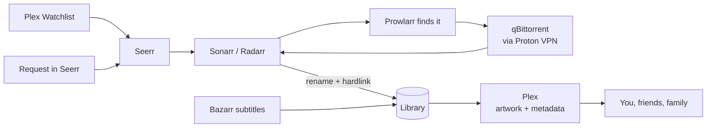

# ⚓ MediaHarbor

A self-hosted media server that fills itself. Add a movie to your Plex Watchlist, and it shows up in your library, sorted, with artwork and subtitles. Share it with friends and family, and let them ask for what they want to watch.

Everything runs in Docker Compose on one Linux box. Downloads go through **Proton VPN**. Admin screens stay private behind **Tailscale**. Only Plex faces the internet.

## How it works



1. You or a friend add a title to a Plex Watchlist, or request it in Seerr.
2. Seerr sends the request to Sonarr (TV) or Radarr (movies).
3. Prowlarr searches your indexers. qBittorrent downloads through the VPN.
4. Sonarr and Radarr rename the files and put them in the library. Bazarr adds subtitles.
5. Plex scans the new file, adds posters and details, and everyone can watch.

## What runs

Core apps always run. Each optional app has a Compose profile of the same name. `config/host.env.example` turns on every profile.

| App | Job | Local port | Profile |
| --- | --- | --- | --- |
| Plex | Watch and share your library | 32400 (public) | Core |
| Seerr | Requests and Plex Watchlist auto-requests | 5055 | Core |
| Sonarr / Radarr | TV / movie automation and file organization | 8989 / 7878 | Core |
| Prowlarr | Indexer manager | 9696 | Core |
| Bazarr | Subtitles | 6767 | Core |
| Gluetun + qBittorrent + port-sync | Proton WireGuard VPN, downloads, forwarded-port updates | 8080 | Core |
| Tautulli | Plex activity and stats | 8181 | `tautulli` |
| Recyclarr | Syncs recommended quality profiles to Sonarr/Radarr | — | `recyclarr` |
| Unpackerr | Extracts archived downloads before import | — | `unpackerr` |
| FlareSolverr | Helps Prowlarr reach Cloudflare-protected indexers | — | `flaresolverr` |
| Jellyfin | Open-source player, alternative to Plex | 8096 | `jellyfin` |
| Lidarr | Music automation | 8686 | `lidarr` |
| SABnzbd | Usenet downloads | 8081 | `sabnzbd` |
| Bookshelf | Audiobook automation (a Readarr revival) | 8787 | `bookshelf` |
| Audiobookshelf | Audiobook player with phone apps | 13378 | `audiobookshelf` |
| Homepage | Dashboard | 3000 | `homepage` |

## Security model

- Every admin port binds to `127.0.0.1`. You reach them over Tailscale or an SSH tunnel.
- Plex port 32400 is the only port open to the network. Plex signs in every client itself.
- qBittorrent shares the VPN container's network. If the VPN drops, its traffic stops.
- No Docker socket mounts, no default passwords, no automatic container updates.
- Every image is pinned to a digest. Renovate proposes updates for you to review.
- Credentials live in ignored files under `secrets/`, mounted as Compose secrets.
- `./harbor check` enforces these rules. CI runs it with a secret scan.

See [SECURITY.md](SECURITY.md) to report a problem.

## Requirements

- Linux on amd64 or arm64, with your media disks mounted.
- Docker Engine **28+** and Compose **2.24+**.
- Python **3.10+**.
- Tailscale on the host.
- A paid Proton VPN plan with P2P port forwarding.
- A Plex account. Plex Pass is optional (it adds hardware transcoding).
- `restic` and `age` for backups.

## Set it up

1. Clone this repository to `/opt/mediaharbor`. Mount your storage by UUID. Create the data folder on that disk. This project does not format disks or set up RAID, ZFS, SMB or NFS.
2. Run `./harbor init`. Edit `config/host.env`: set your media user and group IDs, timezone, storage paths and Proton country. Remove the optional apps you do not want from `COMPOSE_PROFILES`.
3. In Proton, make a WireGuard configuration with **NAT-PMP (port forwarding)** on. Put only its `PrivateKey` in `secrets/wireguard_private_key`. Put a qBittorrent username and a strong password in `secrets/qbit_username` and `secrets/qbit_password`. You set the same account in qBittorrent in step 5.
4. Run `./harbor check`, then `sudo ./harbor prepare`. Then run `./harbor compose up -d gluetun qbittorrent`.
5. Follow [private access](docs/access.md) to log in to qBittorrent for the first time and lock it down.
6. Get a claim token from <https://plex.tv/claim>. It expires in 4 minutes. Put it in `secrets/plex_claim` and run `./harbor compose up -d plex`. Open Plex through an SSH tunnel and add the Plex libraries from the [library folders](docs/operations.md#library-folders) table.
7. Run `./harbor compose up -d`. Set a password in each app. Then connect the apps with the [app connections](docs/operations.md#app-connections) table.
8. [Share with friends and family](docs/sharing.md): Plex library access, Seerr logins, Watchlist auto-requests and audiobooks.
9. Set up [encrypted backups](docs/recovery.md) and do one restore drill.

Before you download anything real, run the [deployment checks](docs/operations.md#deployment-checks).

Use `./harbor compose ...` instead of plain `docker compose`. The wrapper picks the right Compose file and settings, and ignores stray `COMPOSE_*` variables. To run the apps from Portainer instead, follow [Portainer stacks](docs/portainer.md). Run `./harbor check` after you change the configuration.

## Folder layout

```text
DATA_ROOT/
├── torrents/{movies,tv,music,audiobooks} # qBittorrent downloads
├── usenet/{incomplete,complete}          # SABnzbd downloads
└── media/{movies,tv,music,audiobooks}    # Plex and Audiobookshelf libraries
```

Downloads and libraries share one `/data` mount. Sonarr, Radarr, Lidarr and Bookshelf can then use hardlinks: an import is instant and uses no extra space. Keep both folders on the same filesystem.

## Backups

| What | Where | Why |
| --- | --- | --- |
| Compose file, scripts, docs, templates | Git | Rebuild the setup |
| Host settings and credentials | Ignored local files, plus an age-encrypted export or restic | Restore accounts and connections |
| App databases and settings | restic repository on another device | Restore the configured apps |

Media in `DATA_ROOT` is not in the app backup. Protect it separately. See [recovery](docs/recovery.md).

## Maintenance

- Run `./harbor check --example` and `python3 -m unittest discover -s tests` before you push.
- Install the Renovate GitHub app to get image update pull requests. Nothing merges automatically.
- Follow [operations](docs/operations.md) for updates, VPN tests and rollback.

## Docs

- [Private access](docs/access.md): Tailscale, SSH tunnels, access policy.
- [Sharing](docs/sharing.md): friends, family, requests and Watchlists.
- [Operations](docs/operations.md): app connections, health checks, updates.
- [Recovery](docs/recovery.md): backups and rebuilds.
- [Portainer stacks](docs/portainer.md): optional, run the stack from Portainer.
- [Sources](docs/sources.md): vendor documentation this setup follows.

## License

The files in this repository are public domain under [The Unlicense](LICENSE). Do what you want with them.

This repository only puts other projects together. Plex, Jellyfin, Sonarr, Radarr, qBittorrent, Gluetun and every other app and image it uses belong to their owners. Each one keeps its own license.
